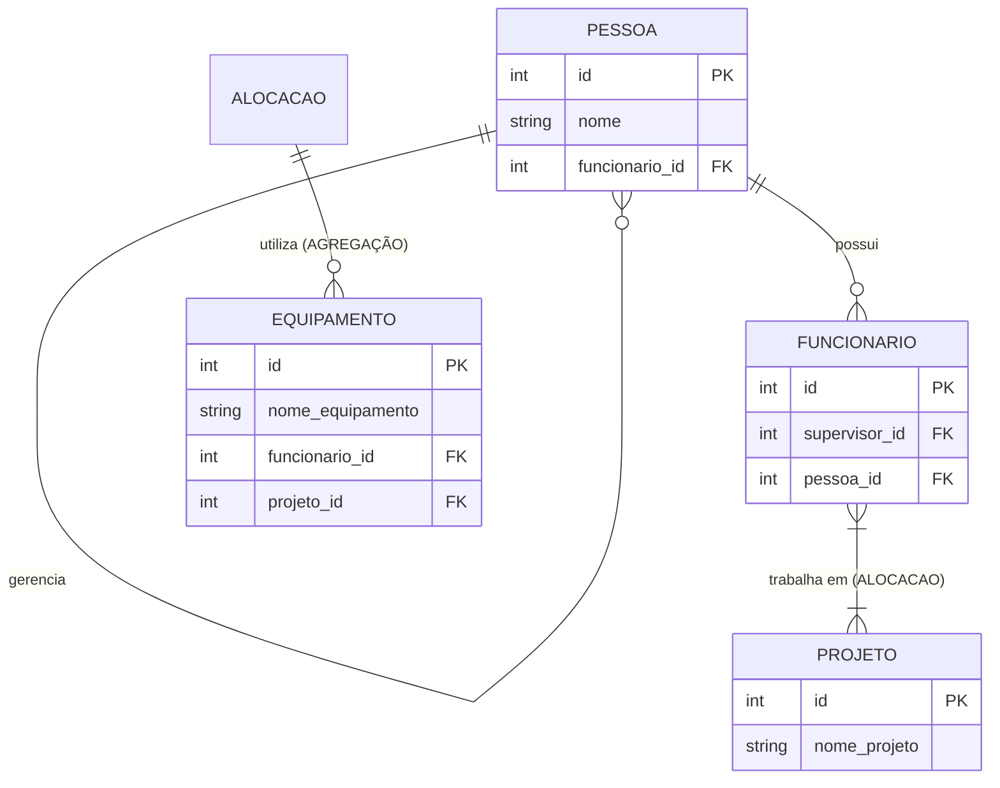

# projeto-bd-agregacao

```mermaid
erDiagram
 PESSOA ||--o{ PESSOA : "gerencia"
 PESSOA ||--o{ FUNCIONARIO : "possui"
 FUNCIONARIO }|--|{ PROJETO : "trabalha em (ALOCACAO)"
 ALOCACAO ||--o{ EQUIPAMENTO : "utiliza (AGREGAÇÃO)"
 PESSOA {
 int id PK
 string nome
 int funcionario_id FK
 }
 FUNCIONARIO {
 int id PK
 int supervisor_id FK
 int pessoa_id FK
 }
 PROJETO {
 int id PK
 string nome_projeto
 }
 EQUIPAMENTO {
 int id PK
 string nome_equipamento
 int funcionario_id FK
 int projeto_id FK
 }
```
