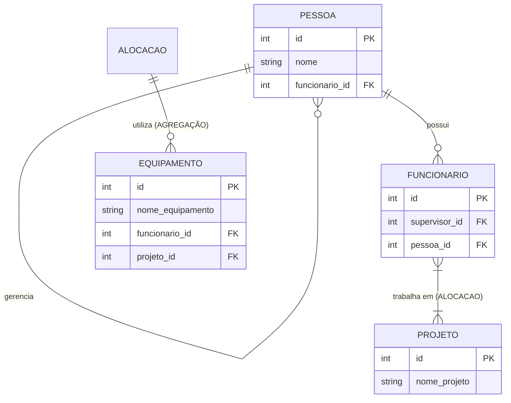

# projeto-bd-agregacao
Alunos: Laura Artemes de Sousa Nunes, Kauenny Leão Castro, Gustavo Cardoso da Silva, Pedro Henrique Carpina Farias Alves, Icaro Lucas Tenorio Rodrigues, John Kleverson Barbosa Rosa

1) Explicar por que a tabela dependente usa ON DELETE CASCADE.
Resposta: A tabela dependente é desnecessária, então não precisamos do ON DELETE CASCADE. Mas, mesmo se tivesse não seria necessário.

2) Mostrar como o equipamento está ligado ao par (Funcionário, Projeto).
Resposta: Está ligado por meio do relacionamento "ALOCACAO" no modelo, no código ele está ligado por meio das chaves estrangeiras na tabela "alocacao_equipamentoKUN".

